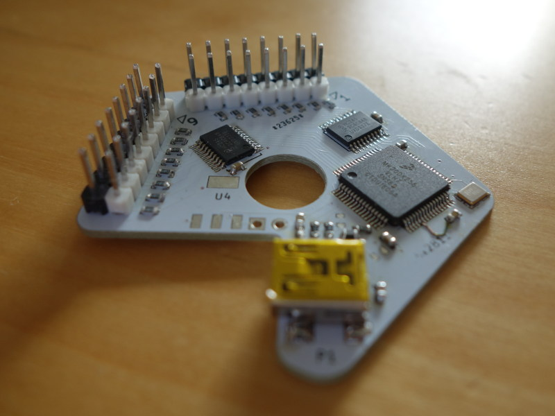

Hex2811 Penta
=============

A 16x WS2812/SK6812 ledstrip driver for my [LED ball with 900x SK6812 LEDs](https://www.youtube.com/watch?v=lAXNFTupz5I).

Essentially a clone to the awesome [fadecandy](https://github.com/scanlime/fadecandy) board,
but with a faster MCU and a second buffer chip connected to PORTC bits 0-7, allowing me to
drive [16x80 RGB chips](https://github.com/brainsmoke/HexWS2811), or 16x60 RGBW chips.

